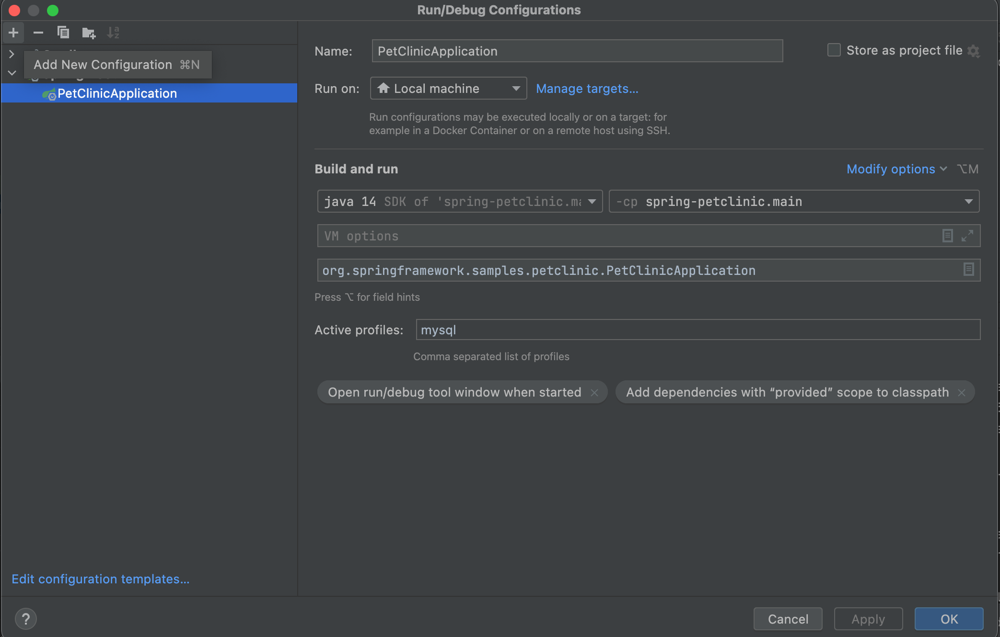
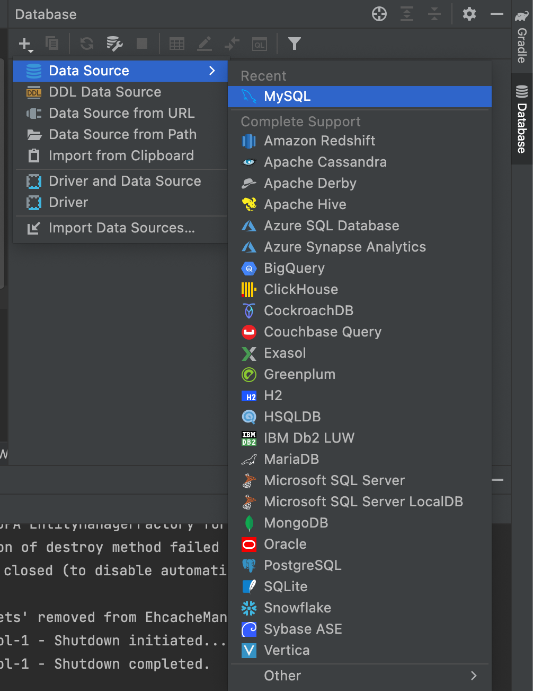
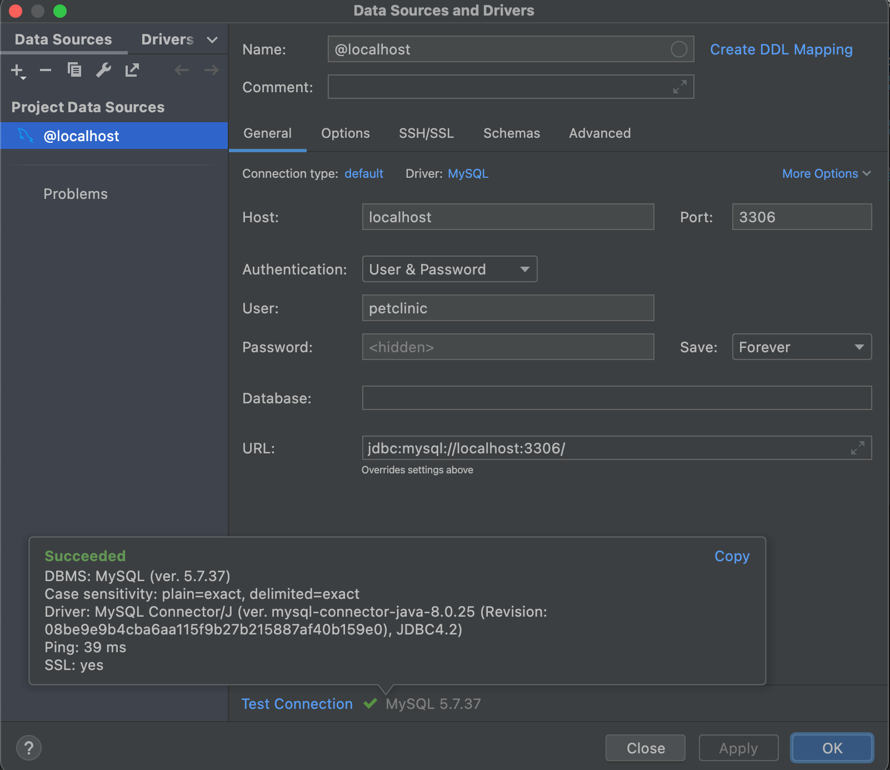

# PetClinic Sample Application

This is a sample project that we will use for injecting our tracking layer. 
Later on, we will use the logged information to create a bot that can replicate user action sequences.

## How to run the project

1. Open the spring-petclinic directory with IntelliJ or ide of your choice.
2. Install dependencies with Gradle or Maven. If you are using IntelliJ, IDE will install dependencies automatically.
3. Run the application.

### To run with mysql database instead of in memory database

1. Start docker desktop application.
2. execute command on spring-petclinic directory:
    ```
    docker-compose up
    ```
3. Select PetClinicApplication configuration on the top bar in IntelliJ. Click Edit configuration.
4. Type mysql in active profiles:
   
5. Click Database section on the right. Click plus sign and add MySQL Datasource. 
   Type petclinic in User and Password fields. 
   Click test connection. Go to Schemas tab and select all schemas. Apply and save changes.
   
   


Now you should be able to see the website by going to browser with this url:
http://localhost:8080/