# User Action Tracker

This is a repository for a group project related to Advanced Software Engineering at UZH MSc Informatics.

## Table of contents

* [Project Summary](#project-summary)
    * [Technologies](#technologies)
    * [UI Application](#ui-application)
    * [Backend (Including Bot and Tracking Layer)](#backend-including-bot-and-tracking-layer)
* [Documentation](#documentation)
* [Project Organization](#project-organization)
    * [Agile Methodology](#agile-methodology)
    * [Meetings](#meetings)
    * [Version Control System](#version-control-system)
    * [Pull Request](#pull-request)
* [Testing and Continuous Integration](#testing-and-continuous-integration)
    * [CI Workflow](#ci-workflow)
        * [Generated Test Results](#generated-test-results)
* [How to run](#how-to-run)
    * [Test with Postman](#test-with-postman)
    * [Test with iOS Application](#test-with-ios-application)
* [Demo](#demo)

## Project Summary

We want to build a bot that can replicate actions taken by users. Doing this for a project with a database would cause some issues with actions that are unique and not repeatable. For cases like; signup (with same credentials), purchase of a specific product, actions related to deletion (trying to replicate the deletion after an item is deleted would not be possible), etc. 

We tried to find an open-source project that stores all data purely in RAM but after researching for hours we could not find one written with Java & Spring Boot so we decided to build a simple project.

We have **built a class** that can perform a series of actions by storing all the information in the RAM meaning any action should be repeatable by the bot from start to end. We created a **REST API** Controller to enable interaction with AccountService.java class and also **built an UI application**.

We are **logging each action taken by the user in AccountService.java class and storing them in the actions.log file.** We used AOP to track the Service class and stored the information using a logger that we have created.

Within the BOT we read the stored information to create the class and call the methods. **We invoke the methods and initialize the object using java reflection.**

### Technologies

The followings are the technologies that we have used:

1. Java with Spring Boot for the backend. This includes:
	- `AccountService.java` that we want to track and a controller for endpoints.
	- Tracking Layer `LoggingAspect.java`
        - AspectJ Weaver for applying aspect to java classes during class-loading.
	- Logger `ASELogger.java`
	- Bot `ASEBot.java`
	- Unit and Integration Tests
2. Swift for iOS (UI) application 
    - UIKit with programmatic layout and URLSession for networking
3. Yaml for creating a CI workflow. We defined 3 jobs in the workflow
	- Linter -> Build -> Run Tests - Generate Test Report

For details, check out the [wiki page](https://github.com/mithatsk/user-action-tracker/wiki) on this repository.

### UI Application

The UI was not a requirement for this project but we have built it to prevent non-systematic behaviors. This way, a user can not call a method with wrong parameters or wrong order. We did not use any third-party dependency for the iOS application for simplicity.

The user interface is quite simple and built only for triggering the main actions that we want to track on the backend side.

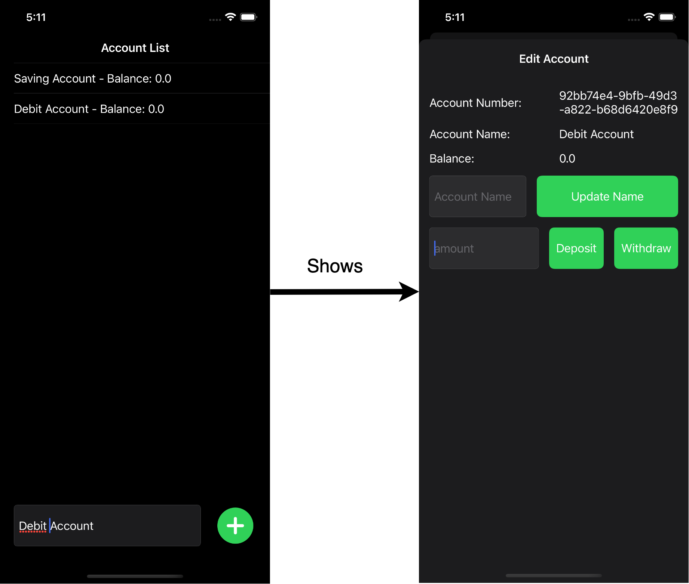

Below is a small sample code showing the programmatic layout with UIKit.


```swift
    ...

    private let createAccountButton: UIButton = {
        let button = UIButton()
        button.setBackgroundImage(.add, for: .normal)
        button.layer.cornerRadius = Constants.buttonSize / 2
        button.clipsToBounds = true
        button.addTarget(self, action: #selector(createAccountButtonTapped), for: .touchUpInside)
        button.translatesAutoresizingMaskIntoConstraints = false
        return button
    }()

    ...

    private func setup() {
        ...

        view.addSubview(createAccountStackView)
        
        ...

        createAccountStackView.addArrangedSubview(createAccountButton)
        
        ...

        createAccountButton.heightAnchor.constraint(equalToConstant: Constants.buttonSize).isActive = true
        createAccountButton.widthAnchor.constraint(equalToConstant: Constants.buttonSize).isActive = true
    }
```

We created a class named `BaseService.swift` responsible for making HTTP requests to the backend. Then using that service we called the endpoints from a class called `AccountService.swift`

We built this with a class protocol-oriented approach which is similar to an interface in other languages like Java. A couple of methods are shown below. Please check the original file for the full code.

```swift

protocol AccountServiceProtocol {
    func fetchAccounts(completion: (([Account]?, NetworkError?) -> Void)?)
    func fetchAccount(request: AccountRequest, completion: ((Account?, NetworkError?) -> Void)?)
    func fetchBalance(request: AccountRequest, completion: ((Double?, NetworkError?) -> Void)?)
    func fetchName(request: AccountRequest, completion: ((String?, NetworkError?) -> Void)?)
    func createAccount(request: NewAccountRequest, completion: ((Account?, NetworkError?) -> Void)?)
    func updateName(request: ChangeAccountNameRequest, completion: ((EmptyModel?, NetworkError?) -> Void)?)
    func withdraw(request: AccountAmountRequest, completion: ((EmptyModel?, NetworkError?) -> Void)?)
    func deposit(request: AccountAmountRequest, completion: ((EmptyModel?, NetworkError?) -> Void)?)
}

final class AccountService: AccountServiceProtocol {
    func fetchAccounts(completion: (([Account]?, NetworkError?) -> Void)?) {
        BaseService.shared.get(endpoint: "account/list", requestBody: EmptyModel(), responseType: [Account].self) { result in
            switch result {
            case let .success(data):
                completion?(data, nil)
            case let .failure(error):
                completion?(nil, error)
            }
        }
    }

    ....
    
    func fetchName(request: AccountRequest, completion: ((String?, NetworkError?) -> Void)?) {
        let parameters = ["accountNumber": request.accountNumber]
        BaseService.shared.get(endpoint: "account/name", requestBody: request, responseType: String.self, parameters: parameters) { result in
            switch result {
            case let .success(data):
                completion?(data, nil)
            case let .failure(error):
                completion?(nil, error)
            }
        }
    }
    
    func createAccount(request: NewAccountRequest, completion: ((Account?, NetworkError?) -> Void)?) {
        BaseService.shared.post(endpoint: "account/new", requestBody: request, responseType: Account.self) { result in
            switch result {
            case let .success(data):
                completion?(data, nil)
            case let .failure(error):
                completion?(nil, error)
            }
        }
    }

    ....
}

```


### Backend (Including Bot and Tracking Layer)

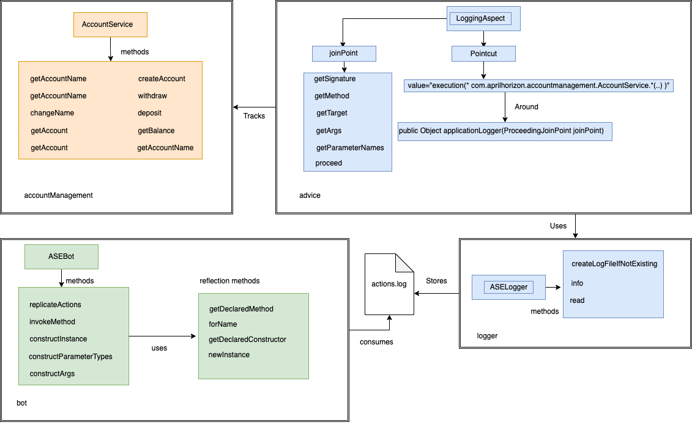

We wanted to achieve tracking and replicating in a generic way rather than writing code for a specific method or class so we used Java Reflection API and AspectJ Weaver for Load-time weaving (LTW)

The `LoggingAspect.java` tracks the `AccountService.java` and logs the information by calling reflection API methods on the joinpoint.

Tracking Layer logs the information using our custom logger class `ASELogger.java`

`ASEBot.java` reads the information using the custom logger and creates arguments, initalizes the object and invokes the methods using reflection methods.

We do not include code snippets for this part since this was previously included in deliverables. For full, documentation please check out the wiki page below.

## Documentation

We created a [WIKI documentation](https://github.com/mithatsk/user-action-tracker/wiki/ASEBot-Implementation) to explain the purpose of our project and how it works. There are four other pages on the wiki:

 - [Tracking layer](https://github.com/mithatsk/user-action-tracker/wiki/User-Actions-Tracking-Layer)
 - [Bot Implemantation](https://github.com/mithatsk/user-action-tracker/wiki/ASEBot-Implementation)

Below two pages are also included within this Readme.md file.

 - [How to run and test](https://github.com/mithatsk/user-action-tracker/wiki/How-to-run-and-test)
 - [Project Organization](https://github.com/mithatsk/user-action-tracker/wiki/Project-Organization)


Documentation also, helps developers new to the project have an idea of how the implementation and intended business logic works.

We replaced the previous Readme.md file with this version to give more detailed information on the project.


## Project Organization

### Agile Methodology

We used the Kanban board to organize the tasks and preferred it over Scrum. Because Kanban offers a **continuous workflow which allows more flexibility**. This way, we could create tasks and work on them without having to wait for the next spring as opposed to the Scrum methodology. We tried to split the work into small tasks specific to a certain objective.

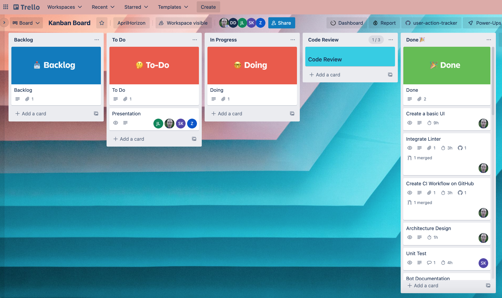


**We also logged our working hours for the related tasks** and attached the pull request to the task and added links to helpful resources within the task description.

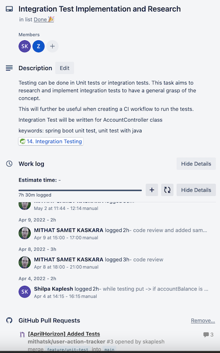

Click the "Work Logs" to expand the related screenshots. (Work logs do not contain time spent during meetings but only efforts related to tasks)

<details>
    <summary>Work Logs</summary>
    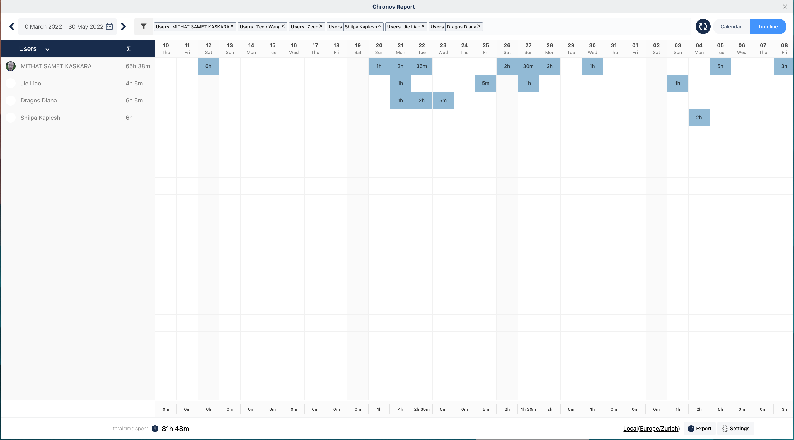
    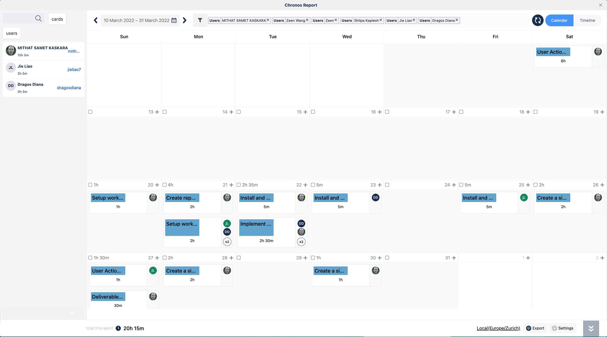
    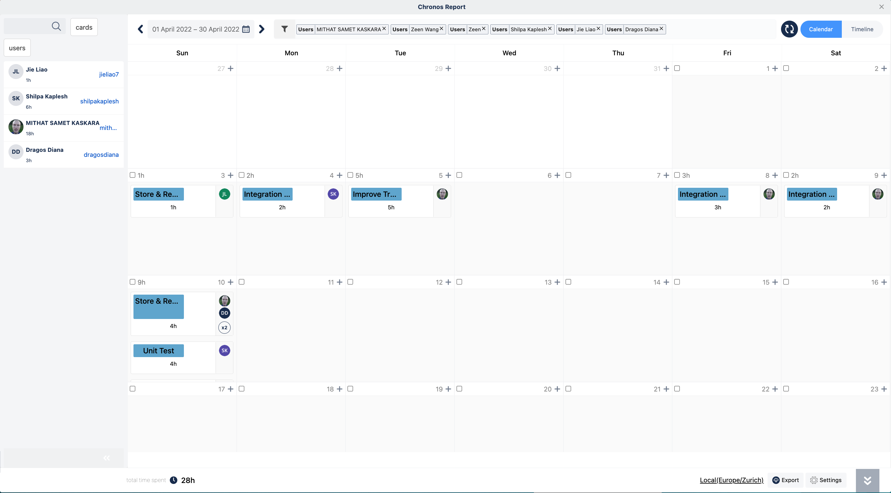
    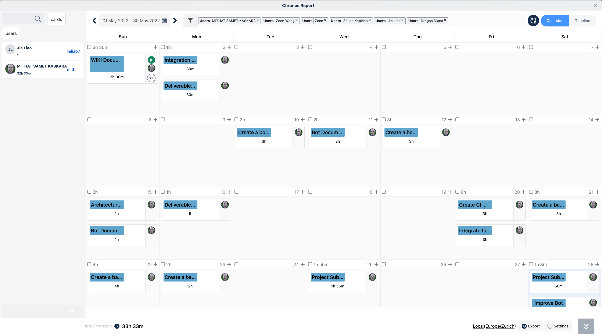
</details>

### Meetings

We organized weekly meetings and talked about the current state of tasks. Also, walked through new tasks for the next sprints and distributed tasks among group members.

We had our weekly meetings on Microsoft Teams and each meeting took approximately 20-30 minutes and sometimes longer if new implementations, tools, or methodologies are explained during the meeting. We started to have meetings after the merging of the groups till the last sprint. Also, created a WhatsApp group chat as a messaging channel.

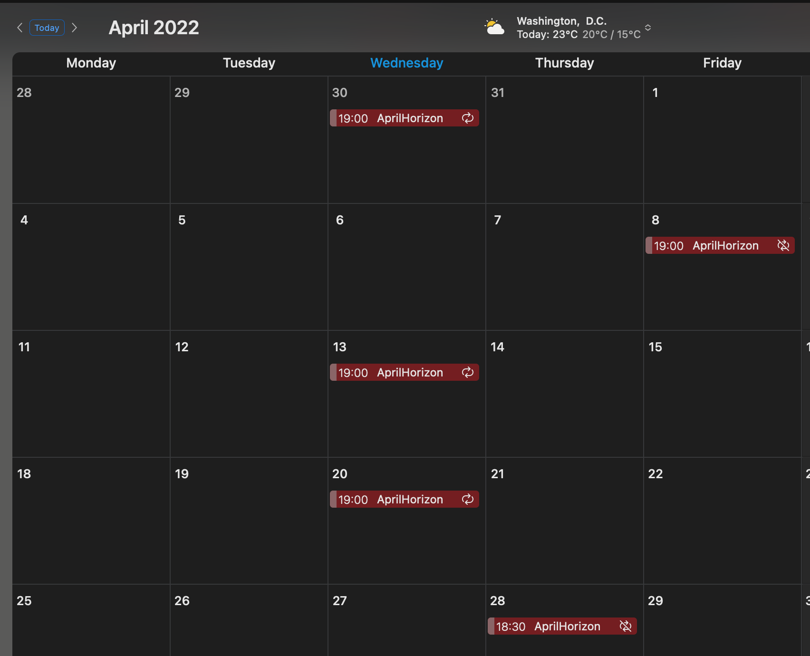

### Version Control System

We used Git as a version control system and worked on feature branches when developing comprehensive additions. Below is the image displaying the branch graph. We also added a complete branch graph in the `branch-graph.txt` file within this folder.

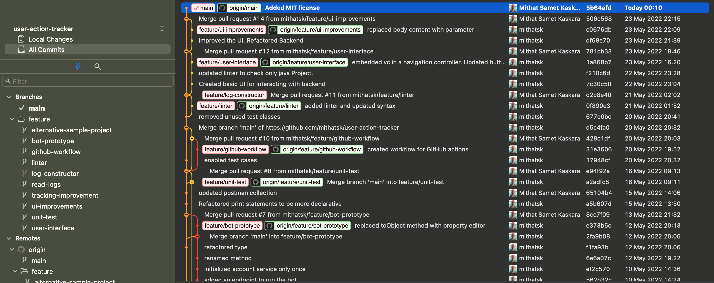

### Pull Request

We worked with a pull request to keep track of our work and help each other improve. We have 15 closed Pull requests in total. 

We pushed minor improvements and urgent commits without creating a pull request after making sure the changes do not break the project.

#### Pull Request Structure:

* Proper title for the overall changes. Also, we added team name at the begning of the title. This is helpful when multiple teams work on the same repository which was not the case for us but still used it to have a convention
* Link to related Trello task
* Descriptive explanation for the changes
* Screenshot or video recording needed.


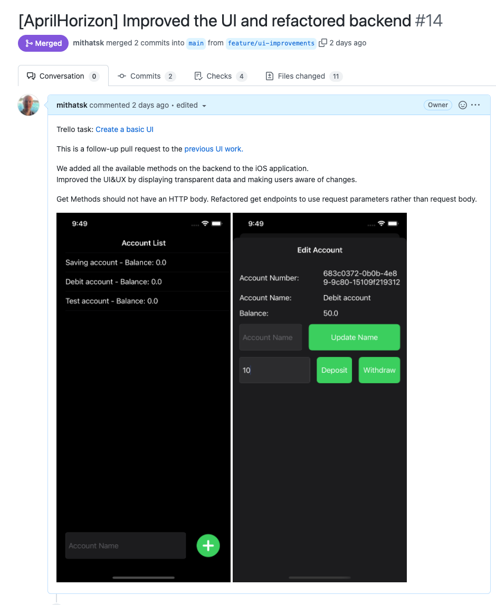


We added comments and suggestions when reviewing the pull request to improve the quality and maintain a standard.

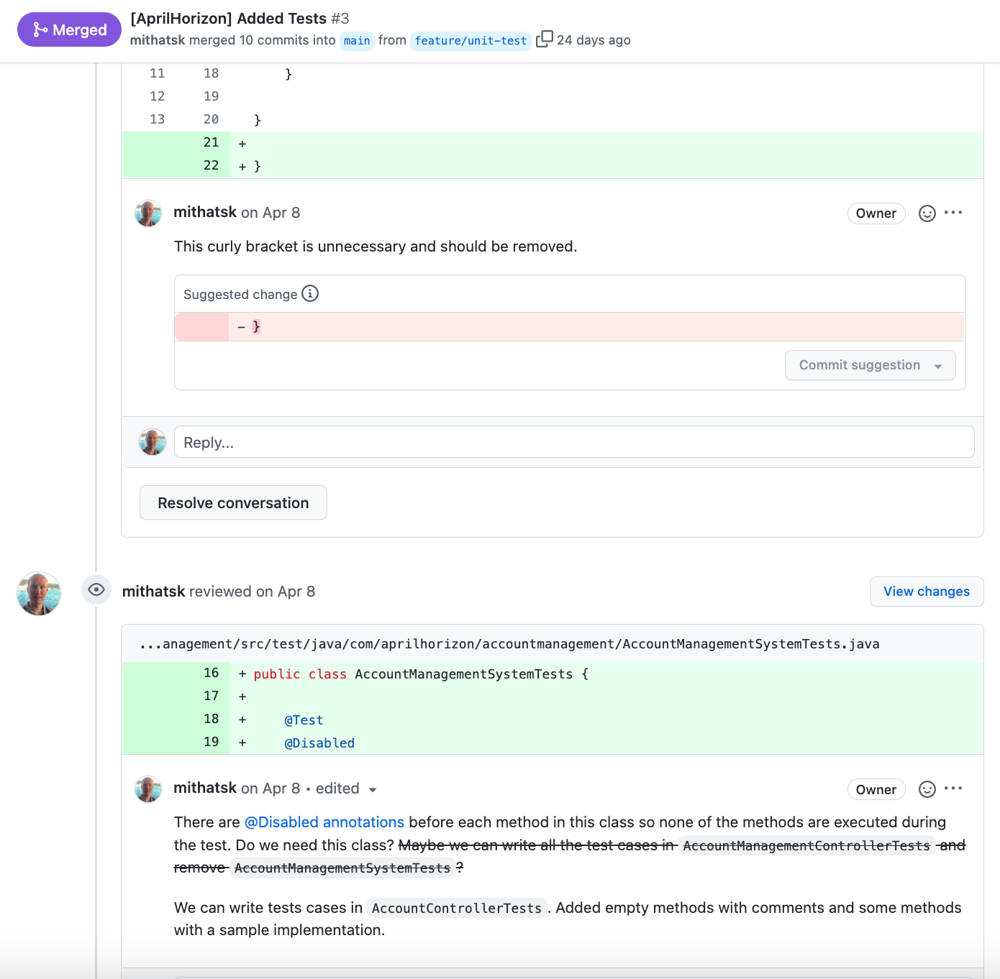


## Testing and Continuous Integration

We have written unit tests for the class that contains the business logic of our main project. Test cases for AccountService class are listed as below in `AccountServiceTests`:

```java
public void testCreateAccount()
public void testInitialBalance()
public void testBalanceAfterDeposit()
public void testInsufficientBalanceWithdraw()
public void testBalanceAfterWithdraw()
public void testGetAccount()
public void testGetAccountName()
public void testChangeName()
public void getAccountsIfNoAccountExists()
```

Similar test cases are implemented for the integration test class `AccountControllerTests`.

We did not write test cases for the bot and track layer since they are separated from the business logic and only perform generic actions. We also implemented a continuous integration for our repository and used the written tests. This prevents merging breaking changes to the project.

### CI Workflow

We created a CI workflow to maintain the stability and quality of our codebase when merging new changes to the main branch. Also, enabled the defined jobs to run for the account-management directory since it is the repo that contains the backend, tracking layer and bot implementations.

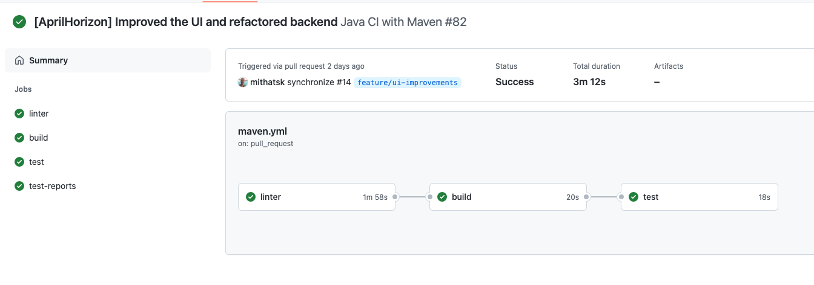

1. The CI workflow first checks the syntax of the project using [super-linter](https://github.com/github/super-linter) 
2. Then, it checks whether the project builds successfully or not.
3. Finally, it runs the tests and generates test reports.

Each step is dependent on the previous one, This is to reduce the workload on the CI and keep the flow of actions in the correct order.

Jobs run on pull requests and pushes to the main branch.


#### Generated Test Results

Below are the generated test reports as a result of the final step of our workflow.

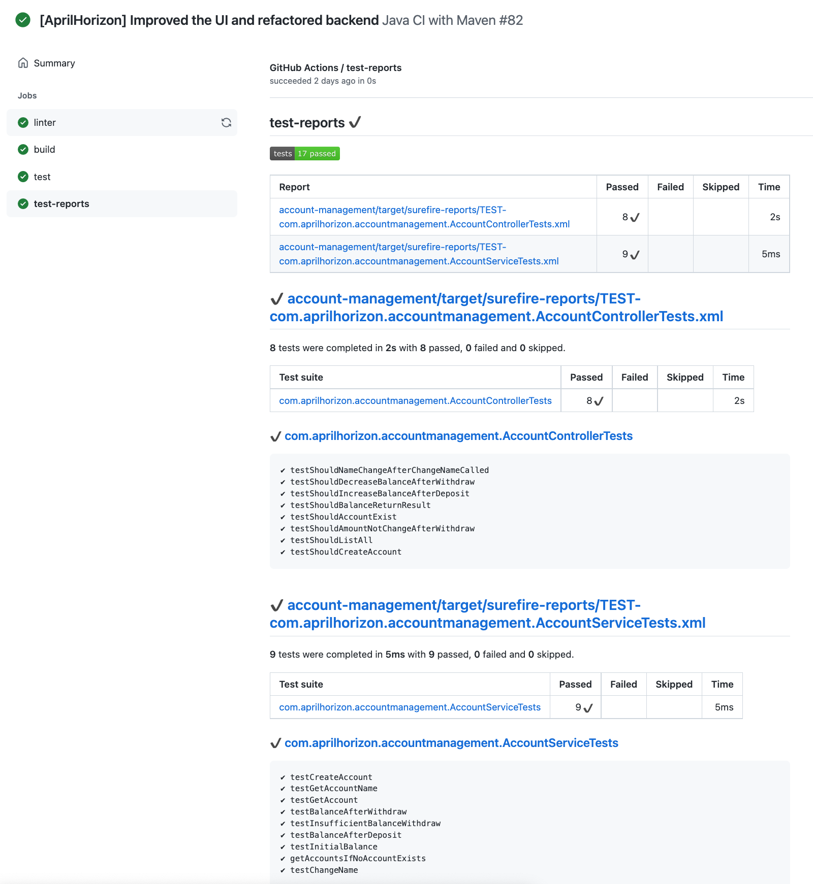

Below is the complete list of jobs defined for our repository.


```yaml
name: Java CI with Maven

on:
  push:
    branches: [ main ]
    paths: 
      - 'account-management/**'
  pull_request:
    branches: [ main ]
    paths: 
      - 'account-management/**'

env:
  POM_PATH: /${{github.workspace}}/account-management/pom.xml

jobs:
  linter:

    runs-on: ubuntu-latest

    steps:
    - uses: actions/checkout@v3
      with:
        # Full git history is needed to get a proper list of changed files within `super-linter`
        fetch-depth: 0
    - name: Lint Code Base
      uses: github/super-linter@v4
      env:
        VALIDATE_ALL_CODEBASE: false
        DEFAULT_BRANCH: main
        GITHUB_TOKEN: ${{ secrets.GITHUB_TOKEN }}
        FILTER_REGEX_INCLUDE: .*/account-management/*.*

  build:

    runs-on: ubuntu-latest
    needs: [linter]

    steps:
    - uses: actions/checkout@v3
    - name: Set up JDK 8
      uses: actions/setup-java@v3
      with:
        java-version: '8'
        distribution: 'temurin'
        cache: maven
    - name: Build with Maven
      run: mvn -B -DskipTests package --file "$POM_PATH"

  test:

    runs-on: ubuntu-latest
    needs: [build]

    steps:
    - uses: actions/checkout@v3
    - name: Run Unit and Integration Tests
      run: mvn test --batch-mode -Dmaven.test.failure.ignore=true --file "$POM_PATH"
    - name: Test Report
      uses: dorny/test-reporter@v1
      if: always()
      with:
        name: test-reports
        path: account-management/target/surefire-reports/*.xml
        reporter: java-junit
        fail-on-error: true
```


## How to run

Navigate to the backend directory

```shell
cd account-management
```

Install dependencies.

```shell
mvn install
```

Run the project with IntelliJ or the below command from the command line.

```shell
mvn spring-boot:run
```

We did not use Docker or microservices since they were not part of "User Action Tracker" as a requirement. Also, they are not in the scope of our project since there is no a database.

### Test with Postman

Download account-management.postman_collection.json then import it to Postman. This represents a collection of HTTP requests in JSON which can be imported into Postman.

First, call the create (account/new) then call other methods using the returned accountNumber value.

Finally, call the `bot/replicateActions` endpoint to trigger the bot.

[Link to download Postman](https://www.postman.com/downloads/)

### Test with iOS Application

Another option is to run our iOS application which provides a user interface for interacting with our main codebase. Unfortunately, distributing the app is currently not possible since it requires a provision (developer account) and this project is just for demo purposes.

##### Requirements
* XCode and MacOS are required to run the project. 

Navigate to the AccountManagementUI folder from the root directory

```shell
cd AccountManagementUI
```

Open the project with XCode and click the run button.

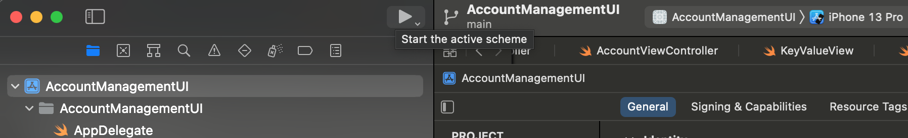

## Demo

You can play the video "user-action-tracker-demo.mov" in the resources folder or click the below image to play it on YouTube.

[](https://www.youtube.com/watch?v=ney9LG-r8FA)
